<p align="center">
  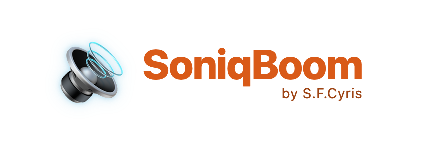
</p>

<p align="center"><strong>The self-hosted music server that actually plays the formats every other server forgot.</strong></p>

<p align="center">
  SID &bull; MOD &bull; XM &bull; IT &bull; AHX &bull; HivelyTracker &bull; NSF &bull; SPC &bull; VGM &bull; MIDI<br>
  &mdash; plus FLAC, DSD, and every modern codec, rendered with the same obsessive care.
</p>

<p align="center">
  Self-hosted &bull; Browser-based &bull; Zero cloud &bull; Zero telemetry &bull; AGPL-3.0
</p>

<p align="center">
  <a href="https://github.com/SFCyris/SoniqBoom/blob/main/LICENSE"></a>
  <a href="https://github.com/SFCyris/SoniqBoom/releases"></a>
  <a href="https://www.python.org/downloads/"></a>
</p>

---

> Your 50,000 `.mod` files. Your mirror of the High Voltage SID Collection. That folder of `.nsf` rips you have carried across four hard drives since 2009.
>
> **SoniqBoom plays *exactly* those files — and treats them like the art they are.**

---

## Retro formats, first-class

SoniqBoom treats **demoscene, chiptune, and tracker formats as first-class citizens** — rendered on the fly, tagged with *real* scene metadata, visualized channel by channel, and streamed to any browser — with casting to Chromecast, AirPlay, and DLNA receivers in Beta.

Then, once you're hooked, you'll notice it's *also* a ruthlessly fast, fully-featured modern music server.

<p align="center">
  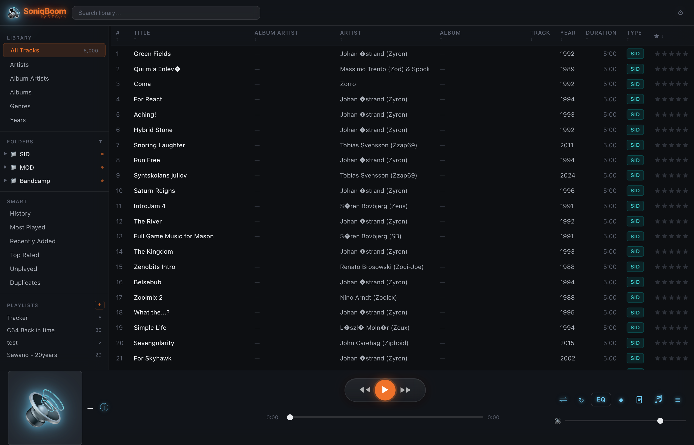
</p>

---

## Every format the others gave up on

**🎮 Chiptune & console** — SID (C64), NSF / NSFe (NES), SPC (SNES), GBS (Game Boy), VGM / VGZ (Sega & arcade), AY (ZX Spectrum / Amstrad), KSS (MSX), SAP (Atari), GYM, HES.

**🎹 Tracker / module** — ProTracker (MOD), FastTracker 2 (XM), Impulse Tracker (IT), ScreamTracker 2 & 3 (STM / S3M), OctaMED, MultiTracker, DigiBooster Pro, Composer 669, UltraTracker, Oktalyzer, Imago Orpheus, Farandole, General DigiMusic, SoundFX, Grave Composer, DSIK… roughly twenty module formats in all.

**🕹️ Amiga heritage** — AHX *and* HivelyTracker (`.hvl`), the latter via a **bundled HivelyTracker engine compiled on first run**. We render the unrenderable.

**🟥 AdLib / OPL2 FM** — the sound of DOS gaming: id Software / Apogee **IMF** (Wolfenstein 3D, Commander Keen, Duke Nukem), plus ROL, CMF, D00, RAD, LucasArts LAA, Sierra SCI, DOSBox DRO, HSC, RIX… rendered through **AdPlug**. (`.imf` files are detected automatically: Imago Orpheus modules play via the tracker engine, id Software IMF via the OPL synth.)

**🎼 MIDI** — synthesized with swappable SoundFonts, plus a one-click SoundFont marketplace.

**…and the everyday stuff, of course** — FLAC, ALAC, MP3, AAC, Ogg Vorbis, Opus, WavPack, Musepack, WAV, AIFF, and 1-bit **DSD** (DSF / DFF / WSD). ZIP archives are scanned *inside the archive*, so your `modarchive_2007.zip` hoard simply works — no unpacking.

> Forty-plus retro formats. One unified render pipeline. Zero "unsupported file" dead ends.

---

## We don't just play them. We understand them.

SoniqBoom speaks the culture:

- **🎚️ Per-channel VU meters for tracker modules.** Watch every Paula voice and sample slot dance in real time, right in the browser. Your `.it` files have never looked like this.
- **🧬 Real SID metadata from HVSC.** Per-tune song lengths straight from `Songlengths.md5` — so your SID tunes show *correct* durations instead of a flat three-minute guess — plus full **STIL** credits and trivia for every subtune.
- **🛰️ The Library Galaxy.** Your entire collection rendered as a drifting star field, every format its own glowing constellation, sized by how much of it you own.
- **🔌 Live signal-chain visualization.** See the exact decode path of the playing track — `HVL → hvl2wav → PCM → ReplayGain → WebAudio` — laid out and lit up. Honest, nerdy, and weirdly mesmerizing.
- **🗂️ Multi-subtune aware.** SID, NSF, and HVL tunes with multiple subsongs are addressed individually, not flattened into one.
- **📼 Bundled HivelyTracker decoder.** `.hvl` modules play out of the box — nothing extra to install.

<p align="center">
  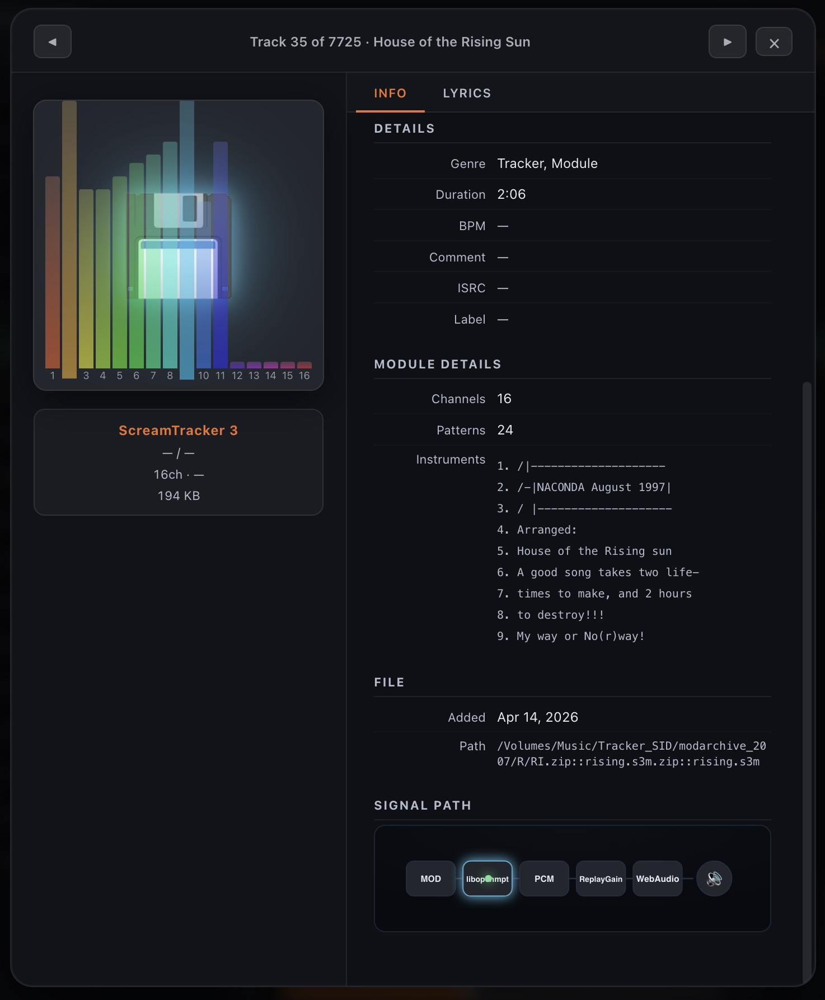
  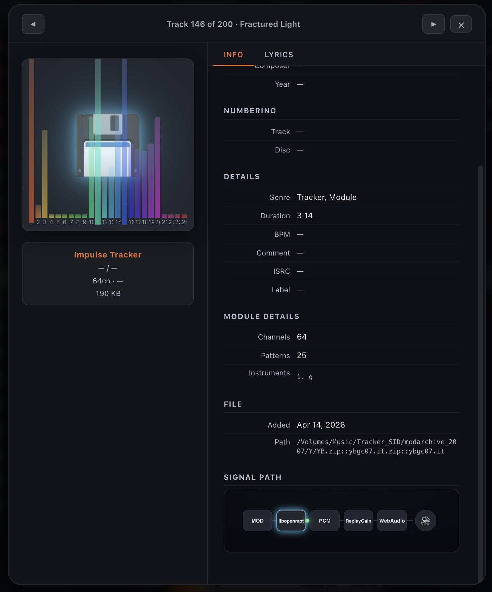
</p>
<p align="center"><sub>Open any module and you get per-channel VU meters, real module metadata — channels, patterns, instrument names — and a live decode-chain readout. Here a 16-channel ScreamTracker 3 and a 64-channel Impulse Tracker.</sub></p>

<p align="center">
  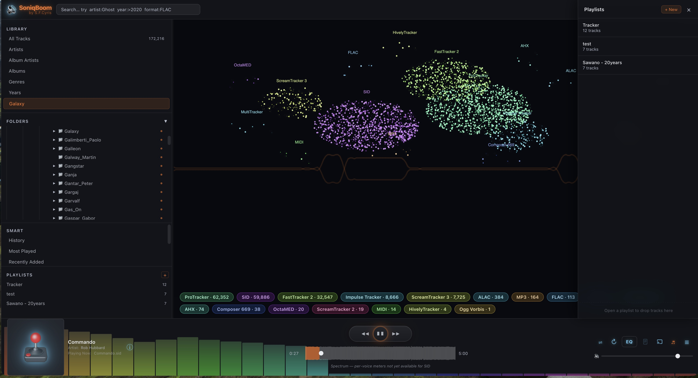
</p>
<p align="center"><sub>The Library Galaxy — your whole collection as a drifting star field, every format its own glowing constellation, sized by how much of it you own.</sub></p>

---

## Oh — and it happens to be a complete modern music server

Every retro format is rendered to standard audio on the fly — a 1987 SID tune streams to your phone *exactly* like a FLAC does (casting it to a HomePod or the speakers in the next room is in Beta). The same server that sees your `.mod` hoard handles your everyday listening.

- **⚡ Entire library held in RAM.** Browse and search a six-figure collection as fast as a ten-song playlist.
- **📻 Internet radio — with the scene built in.** A curated demoscene & chiptune station pack — **SceneSat**, **Nectarine**, **SLAY Radio**, **Kohina**, **Radio PARALAX**, **CVGM** and **Rainwave** — alongside the worldwide [Radio Browser](https://www.radio-browser.info/) directory (browse by continent and country), with live now-playing titles and one-click favourites.
- **🎲 Instant Mix radio.** Press the radio button on any track and SoniqBoom builds an endless, self-refilling queue around it — picked by genre, artist, era, tempo and format — in a focused radio view with a live oscilloscope over the cover. A SID radio stays chiptune; a FLAC radio follows the genre.
- **🔎 More like this & smart playlists.** Surface the closest-sounding tracks to any song (scored by audio similarity), and save any search — say `format:SID year:>1988` — as a playlist that keeps itself up to date.
- **📡 Cast / AirPlay / DLNA (Beta).** Send anything — yes, even a SID tune, transcoded on the fly — to Chromecast, Apple TV, HomePod, or UPnP receivers.
- **🔁 Multi-room sync.** The same track, in lockstep, across every browser on your LAN.
- **📱 OpenSubsonic API.** Works with Amperfy, Symfonium, DSub, and the rest of the Subsonic app ecosystem.
- **🗄️ Network shares without mounting.** Attach FTP, SMB, and WebDAV libraries straight from the admin UI — no OS mount required.
- **👥 Multi-user with roles**, **last.fm + ListenBrainz scrobbling**, **time-synced lyrics**, **podcast & audiobook chapters**, **in-browser tag editing**, **field-operator search** (`artist:Ghost year:>2020 format:FLAC`), **dark mode**, **installable PWA**, and **absolutely zero telemetry**.

<p align="center">
  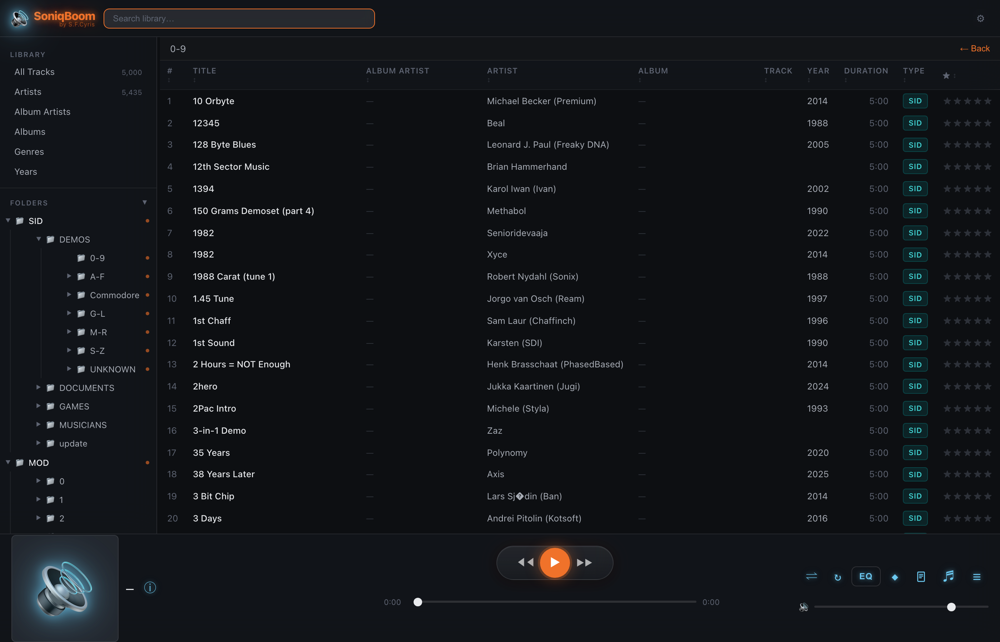
  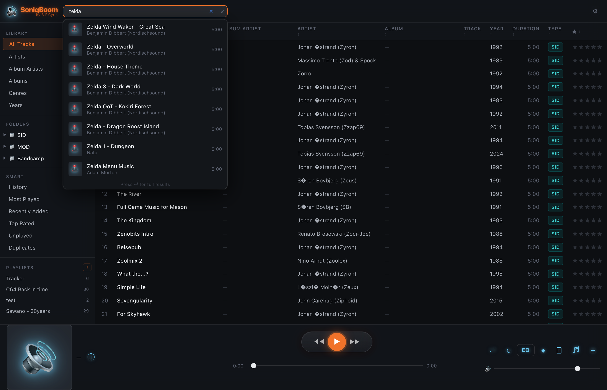
</p>
<p align="center">
  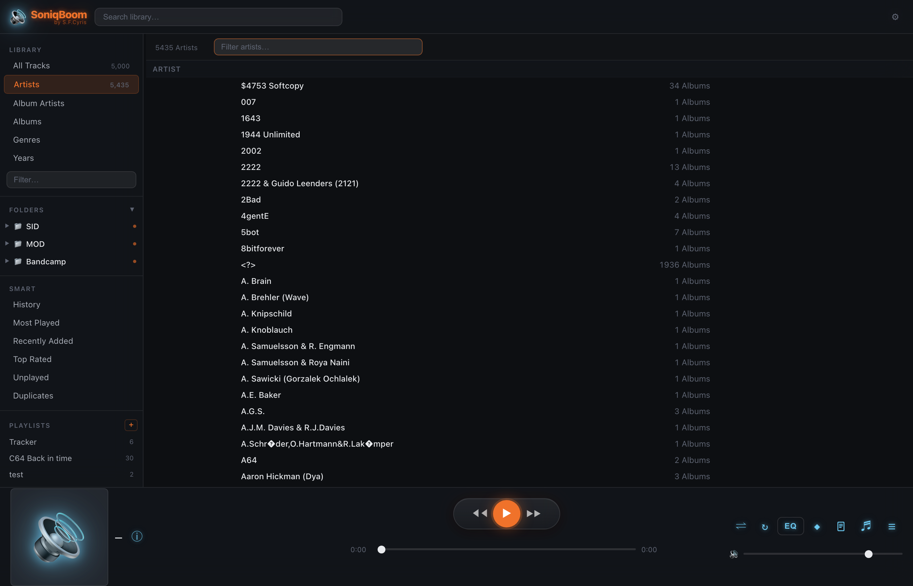
  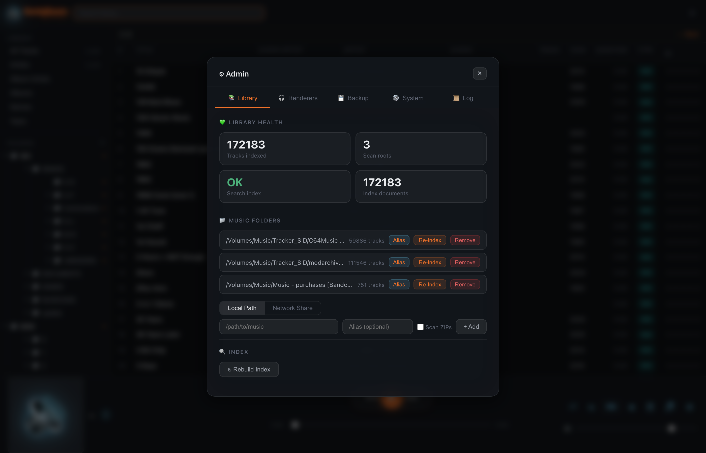
</p>
<p align="center">
  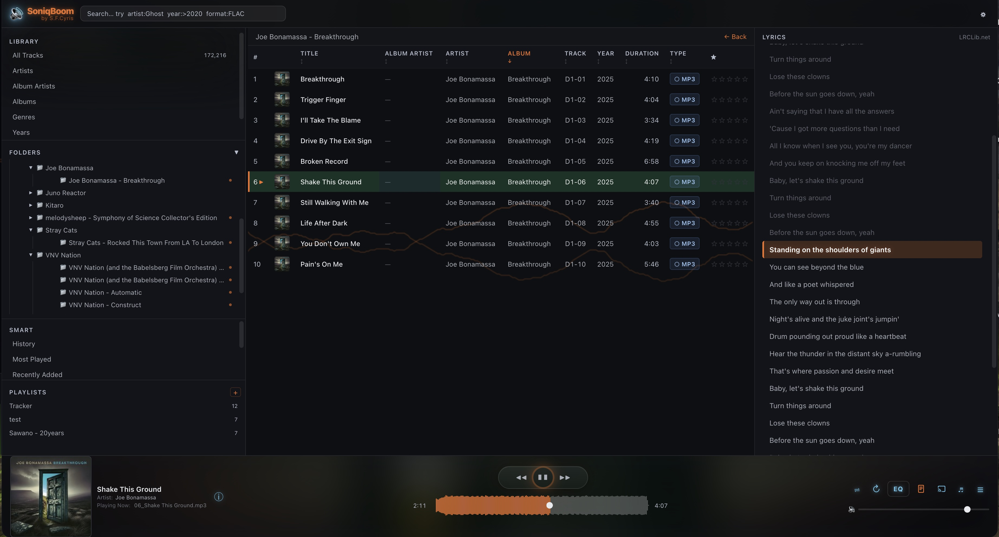
</p>
<p align="center"><sub>Time-synced lyrics scroll line-by-line with playback — fetched from LRCLib when the file has none embedded.</sub></p>

<p align="center">
  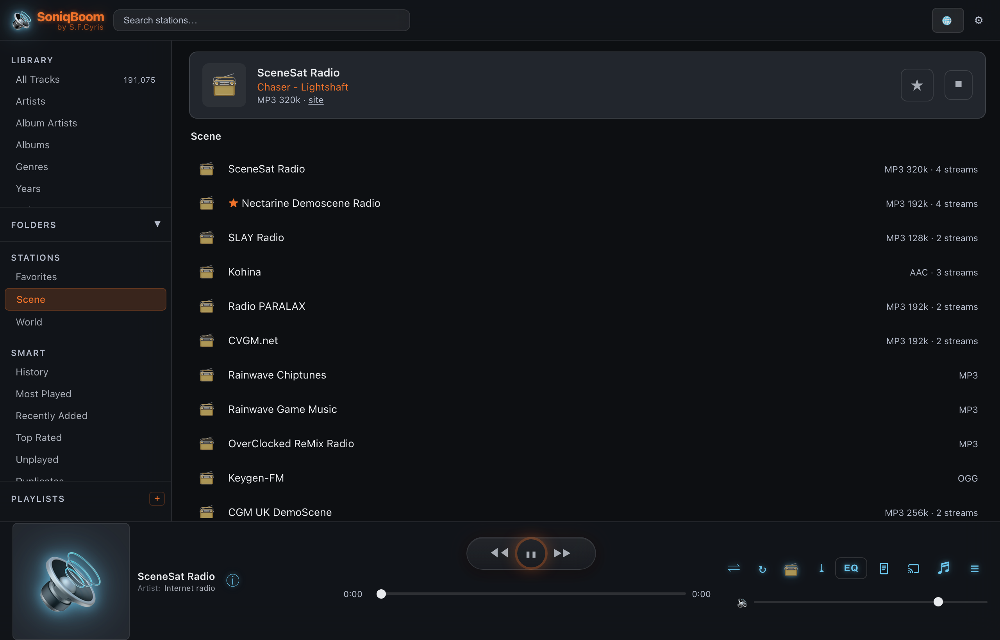
</p>
<p align="center"><sub>Internet-radio <b>Stations</b> — a curated demoscene/chiptune pack plus the worldwide Radio Browser directory (continent → country), with the live now-playing track and one-click favourites.</sub></p>

<p align="center">
  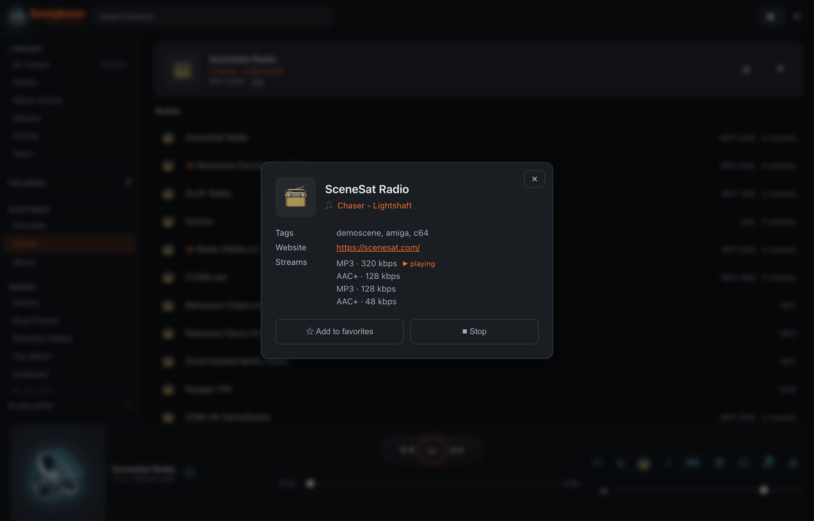
  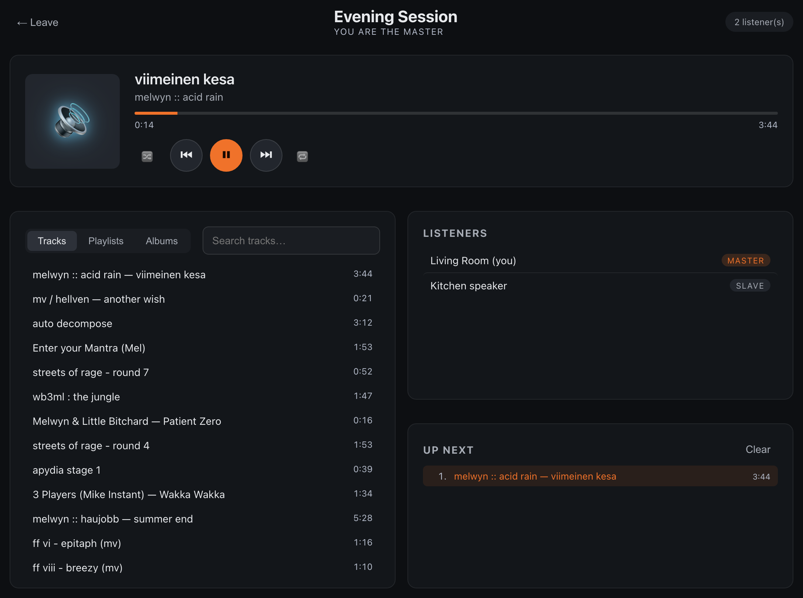
</p>
<p align="center"><sub>Left: a <b>scene radio</b> station up close — tags, website, the live now-playing track, and every available stream quality. Right: <b>multi-room sync</b> — the same track, in lockstep, across every browser on your LAN.</sub></p>

---

## Install

Point it at your HVSC mirror. Point it at your Modland archive. Point it at the FLAC rips you actually paid for. Hit scan — about two minutes per 50,000 tracks — and all of it plays.

**macOS** (one-shot install + start):

```bash
git clone https://github.com/SFCyris/SoniqBoom.git
cd SoniqBoom
bash install.sh        # installs Python, ffmpeg, and the optional retro renderers
bash run.sh            # starts the server on port 8080
```

Then open `http://localhost:8080` in any browser.

**Linux** — install the prerequisites with your package manager, then run the same `run.sh`:

```bash
sudo apt install -y python3 python3-venv ffmpeg \
    fluid-synth libopenmpt0 libsidplayfp   # last 3 are optional renderers
git clone https://github.com/SFCyris/SoniqBoom.git
cd SoniqBoom
python3 -m venv .venv && source .venv/bin/activate
pip install -e .
bash run.sh
```

`bash shutdown.sh` stops it; `bash restart.sh` restarts it. To change the default port: `bash run.sh --port 9090` (or set `SONIQBOOM_PORT=9090`).

> **`install.sh` installs every renderer for you** — `sidplayfp` (SID), `fluidsynth` (MIDI), `libopenmpt` (trackers), `uade` (AHX), `libgme` (console chiptunes), and `adplay` (AdPlug, AdLib/OPL) — on macOS via Homebrew and on Linux via apt / dnf / pacman / zypper. On a manual install, add the same packages with your package manager; if one is missing, SoniqBoom names the exact package and everything else keeps working. (HivelyTracker needs nothing extra — it's bundled.)

---

## First-time setup

1. **Create the first admin account.** A fresh install has no users, and UI registration is locked until at least one admin exists, so the first one is bootstrapped from the CLI on the server host:

   ```bash
   .venv/bin/soniqboom-setadm -user alice -passwd 'changeme123'
   ```

   Username is 2–64 chars (letters, digits, `.`, `_`, `-`); password is at least 8 chars. New users default to the `admin` role. To rotate the password later, re-run with a new `-passwd`; to add others, use `-role admin|edit|readonly` or invite them from the admin UI once signed in.

2. **Sign in.** Open `http://localhost:8080`, enter the credentials you just set, and you'll land in the library.

3. Click the **gear icon** (top-right) to open the admin panel.
4. **Add music folders** — enter a path (local, FTP, SMB, or WebDAV) and click **Add**.
5. Wait for the initial scan (about 2 minutes per 50,000 tracks).
6. Close the admin panel. Your library is ready.

---

## Supported formats

| Family | Formats | Rendered by |
|--------|---------|-------------|
| **Lossless / PCM** | FLAC, ALAC (M4A), WAV, AIFF, WavPack, Musepack | native / ffmpeg |
| **Lossy** | MP3, AAC, Ogg Vorbis, Opus | native / ffmpeg |
| **DSD (1-bit)** | DSF, DFF, WSD | ffmpeg |
| **SID** (C64) | `.sid`, `.psid` | sidplayfp + HVSC Songlengths & STIL |
| **MIDI** | `.mid`, `.midi` | FluidSynth + SoundFonts |
| **Tracker / module** | MOD, S3M, XM, IT, MTM, MED, OCT, 669, DBM, ULT, STM, FAR, AMF, GDM, IMF *(Imago Orpheus)*, OKT, SFX, WOW, DSM | libopenmpt |
| **Amiga** | AHX, HivelyTracker (HVL) | uade123 / bundled HivelyTracker engine |
| **Console chiptune** | NSF, NSFe, SPC, GBS, VGM, VGZ, AY, KSS, SAP, GYM, HES | libgme |
| **AdLib / OPL2 FM** | id IMF *(Wolfenstein 3D, Keen…)*, ROL, CMF, D00, RAD, LAA, SCI, DRO, HSC, RIX, A2M, ADL, BAM, KSM | AdPlug (`adplay`) |

ZIP archives are scanned and played **inline** — tracks inside `.zip` files appear in your library without unpacking.

---

## Configuration

| Platform | Path |
|----------|------|
| macOS | `~/Library/Application Support/SoniqBoom/SoniqBoom.conf` |
| Linux | `~/.local/share/soniqboom/SoniqBoom.conf` |

Most settings are changeable from the admin UI. Environment variables (`SONIQBOOM_HOST`, `SONIQBOOM_PORT`, …) override config-file values.

---

## Who this is for

- **Demosceners & chiptune collectors** whose libraries are invisible to every other server.
- **HVSC / Modland / Modarchive hoarders** who want correct song lengths, STIL credits, and channel-level VU meters — not a generic file list.
- **Hi-fi self-hosters** who *also* keep FLAC and DSD and refuse to run a cloud account to hear them.
- **Anyone** who believes a 40-year-old `.mod` deserves a real player, not a "format not supported" toast.

If your music collection has a weird corner, SoniqBoom is the server that finally lights it up.

**Got a format we don't render?** That's the most interesting kind of bug report. Open an [issue](https://github.com/SFCyris/SoniqBoom/issues) with a sample file, [star the repo](https://github.com/SFCyris/SoniqBoom) if it earned it, and send PRs.

---

## License

SoniqBoom is licensed under the **GNU Affero General Public License v3.0 or later (AGPL-3.0-or-later)**. See [LICENSE](LICENSE) for the full text.

In short: run, study, modify, and redistribute freely. If you distribute a modified version — including running it as a network service others interact with — you must make the corresponding source of your modifications available under the same license.

Commercial licensing (for use cases that cannot comply with AGPL-3.0's network-use copyleft) is available from the copyright holder on request — contact <scyris@outlook.com>.

SoniqBoom is intended for streaming music you already own or have the right to use. Users are solely responsible for ensuring their use complies with applicable copyright law.

---

## Attributions

SoniqBoom stands on the shoulders of these excellent open-source projects.

- [FastAPI](https://github.com/tiangolo/fastapi) by [Sebastián Ramírez](https://github.com/tiangolo) is licensed under [MIT License](https://github.com/tiangolo/fastapi/blob/master/LICENSE)
- [Uvicorn](https://github.com/encode/uvicorn) by [Encode](https://github.com/encode) is licensed under [BSD-3-Clause](https://github.com/encode/uvicorn/blob/master/LICENSE.md)
- [httpx](https://github.com/encode/httpx) by [Encode](https://github.com/encode) is licensed under [BSD-3-Clause](https://github.com/encode/httpx/blob/master/LICENSE.md)
- [Pydantic](https://github.com/pydantic/pydantic) by [Pydantic](https://github.com/pydantic) is licensed under [MIT License](https://github.com/pydantic/pydantic/blob/main/LICENSE)
- [pydantic-settings](https://github.com/pydantic/pydantic-settings) by [Pydantic](https://github.com/pydantic) is licensed under [MIT License](https://github.com/pydantic/pydantic-settings/blob/main/LICENSE)
- [aiofiles](https://github.com/Tinche/aiofiles) by [Tin Tvrtković](https://github.com/Tinche) is licensed under [Apache License 2.0](https://github.com/Tinche/aiofiles/blob/master/LICENSE)
- [python-multipart](https://github.com/Kludex/python-multipart) by [Marcelo Trylesinski](https://github.com/Kludex) is licensed under [Apache License 2.0](https://github.com/Kludex/python-multipart/blob/master/LICENSE.txt)
- [websockets](https://github.com/python-websockets/websockets) by [Aymeric Augustin](https://github.com/aaugustin) is licensed under [BSD-3-Clause](https://github.com/python-websockets/websockets/blob/main/LICENSE)
- [watchdog](https://github.com/gorakhargosh/watchdog) by [Yesudeep Mangalapilly](https://github.com/gorakhargosh) is licensed under [Apache License 2.0](https://github.com/gorakhargosh/watchdog/blob/master/LICENSE)
- [Mutagen](https://github.com/quodlibet/mutagen) by [Quod Libet](https://github.com/quodlibet) is licensed under [GPL-2.0](https://github.com/quodlibet/mutagen/blob/main/COPYING)
- [mido](https://github.com/mido/mido) by [mido](https://github.com/mido) is licensed under [MIT License](https://github.com/mido/mido/blob/main/LICENSE)
- [Pillow](https://github.com/python-pillow/Pillow) by [Python Pillow](https://github.com/python-pillow) is licensed under [HPND License](https://github.com/python-pillow/Pillow/blob/main/LICENSE)
- [cryptography](https://github.com/pyca/cryptography) by [PyCA](https://github.com/pyca) is licensed under [Apache-2.0 / BSD-3-Clause](https://github.com/pyca/cryptography/blob/main/LICENSE)
- [PyYAML](https://github.com/yaml/pyyaml) by [YAML](https://github.com/yaml) is licensed under [MIT License](https://github.com/yaml/pyyaml/blob/main/LICENSE)
- [python-dotenv](https://github.com/theskumar/python-dotenv) by [Saurabh Kumar](https://github.com/theskumar) is licensed under [BSD-3-Clause](https://github.com/theskumar/python-dotenv/blob/main/LICENSE)
- [defusedxml](https://github.com/tiran/defusedxml) by [Christian Heimes](https://github.com/tiran) is licensed under [PSF-2.0](https://github.com/tiran/defusedxml/blob/main/LICENSE)
- [smbprotocol](https://github.com/jborean93/smbprotocol) by [Jordan Borean](https://github.com/jborean93) is licensed under [MIT License](https://github.com/jborean93/smbprotocol/blob/master/LICENSE)
- [pyatv](https://github.com/postlund/pyatv) by [Pierre Ståhl](https://github.com/postlund) is licensed under [MIT License](https://github.com/postlund/pyatv/blob/master/LICENSE.md)
- [PyChromecast](https://github.com/home-assistant-libs/pychromecast) by [Home Assistant](https://github.com/home-assistant-libs) is licensed under [MIT License](https://github.com/home-assistant-libs/pychromecast/blob/master/LICENSE)
- [async-upnp-client](https://github.com/StevenLooman/async_upnp_client) by [Steven Looman](https://github.com/StevenLooman) is licensed under [MIT License](https://github.com/StevenLooman/async_upnp_client/blob/master/LICENSE)
- [rumps](https://github.com/jaredks/rumps) by [Jared Suttles](https://github.com/jaredks) is licensed under [BSD-3-Clause](https://github.com/jaredks/rumps/blob/master/LICENSE)
- [pyobjc](https://github.com/ronaldoussoren/pyobjc) by [Ronald Oussoren](https://github.com/ronaldoussoren) is licensed under [MIT License](https://github.com/ronaldoussoren/pyobjc/blob/master/License.txt)

External tools (invoked via subprocess — not linked into SoniqBoom):

- [FFmpeg](https://ffmpeg.org/) is licensed under [LGPL-2.1 / GPL-2.0](https://ffmpeg.org/legal.html) (depending on build configuration)
- [libsidplayfp](https://github.com/libsidplayfp/libsidplayfp) is licensed under [GPL-2.0](https://github.com/libsidplayfp/libsidplayfp/blob/master/COPYING)
- [FluidSynth](https://github.com/FluidSynth/fluidsynth) is licensed under [LGPL-2.1](https://github.com/FluidSynth/fluidsynth/blob/master/LICENSE)
- [libopenmpt](https://lib.openmpt.org/libopenmpt/) by [OpenMPT](https://openmpt.org/) is licensed under [BSD-3-Clause](https://lib.openmpt.org/libopenmpt/license/)
- [UADE](https://zakalwe.fi/uade/) (Unix Amiga Delitracker Emulator) — used to render AHX and other Amiga formats
- [HivelyTracker replayer](https://github.com/pete-gordon/hivelytracker) by Pete Gordon et al. is licensed under [BSD-3-Clause](https://github.com/pete-gordon/hivelytracker) — vendored to decode `.hvl` modules
- [Game_Music_Emu (libgme)](https://github.com/libgme/game-music-emu) is licensed under [LGPL-2.1](https://github.com/libgme/game-music-emu/blob/master/license.txt)

Data / assets:

- [GeneralUser GS SoundFont](https://schristiancollins.com/generaluser.php) by S. Christian Collins (Free, attribution required) — default SoundFont for MIDI synthesis
- [HVSC (High Voltage SID Collection)](https://www.hvsc.c64.org/) (Free archive of SID music) — Songlengths.md5 and STIL metadata used for SID playback

The full per-component license texts are recorded in [THIRD-PARTY-LICENSES.md](THIRD-PARTY-LICENSES.md).

**SoniqBoom license:** [AGPL-3.0-or-later](LICENSE)

---

<p align="center">
  <strong>Point it at the weird corner of your collection. Watch it light up.</strong><br>
  <a href="https://github.com/SFCyris/SoniqBoom">github.com/SFCyris/SoniqBoom</a> &middot; <a href="https://github.com/SFCyris/SoniqBoom/issues">Issues</a>
</p>

<p align="center"><sub>Copyright &copy; 2026 S.F. Cyris &middot; Built by S.F. Cyris</sub></p>
